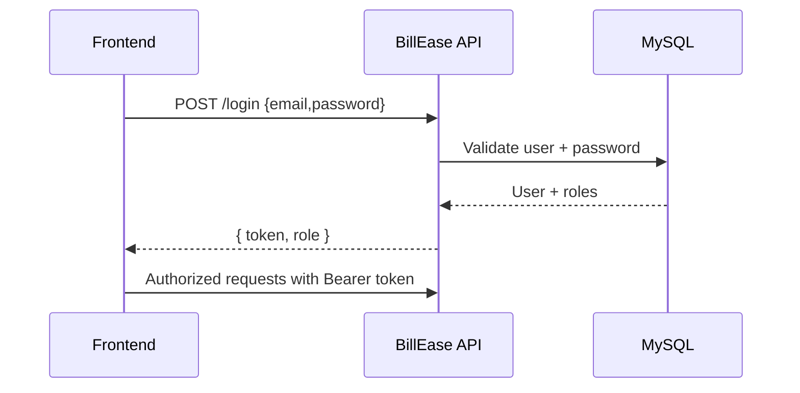
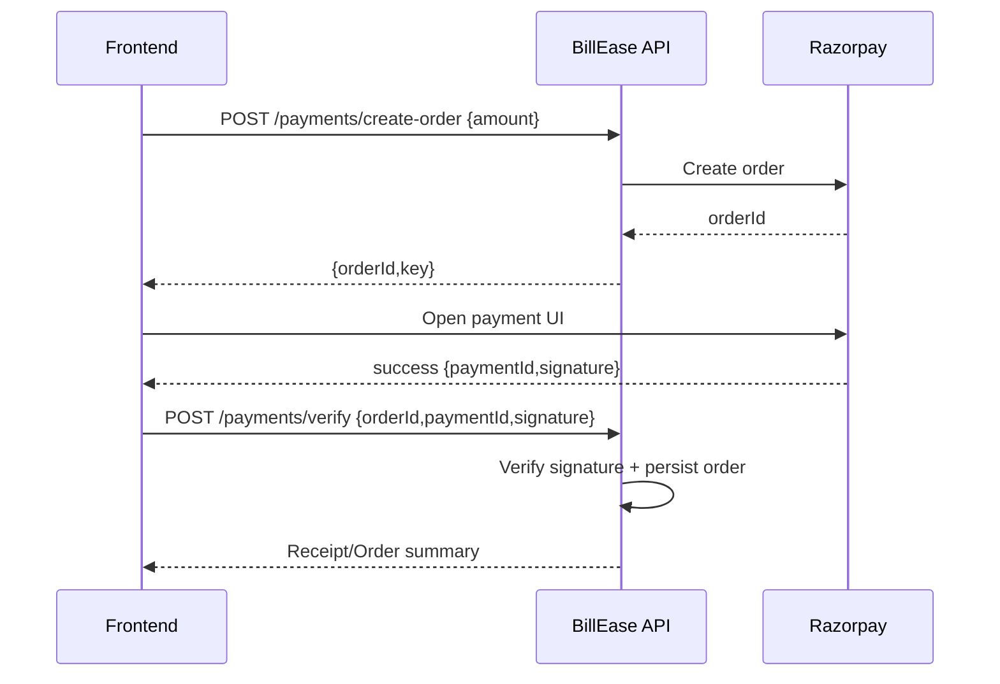

# BillEase Backend

Robust billing and POS REST API powering the BillEase frontend. Secure auth, catalog, orders, payments, and dashboard analytics built with Spring Boot and MySQL.

Badges: Java 21 • Spring Boot 3.4.x • MySQL 8 • JWT • Razorpay

## Purpose
- Provide a secure, scalable API for point‑of‑sale billing
- Manage users, categories, items, orders, and payments
- Power the React frontend with clean, versioned endpoints under /api/v1.0

## How it works (high‑level)
1) Auth: client calls POST /login → JWT issued, used in Authorization: Bearer <token>.
2) Catalog: admin manages categories/items; public fetches are authorized.
3) Cart → Order: client POST /orders with items + customer; backend computes totals, saves order.
4) Payments: client POST /payments/create-order → Razorpay; after success, POST /payments/verify to confirm and update order status.
5) Dashboard: aggregates sales, orders, recent activity.

Sequence (login)


Sequence (checkout)


## Tech stack
- Java 21, Spring Boot 3.4.x, Spring Security (JWT), Spring Data JPA
- MySQL 8.x, Flyway (optional), Caffeine cache (optional)
- Razorpay SDK, Mail (optional), AWS S3 (optional, local uploads by default)

## Project layout
```
src/main/java/.../
├─ config (SecurityConfig, OpenApiConfig, CacheConfig, DataInitializer)
├─ controller (Auth, User, Category, Item, Order, Payment, Dashboard)
├─ service (+ impl)
├─ dto (request/response)
├─ entity (User, Category, Item, Order, OrderItem, BaseEntity)
├─ repository
└─ exception, filter, util
```

## Run locally
Prereqs: Java 21, Maven, MySQL

1) Create DB
```sql
CREATE DATABASE billease_db;
```
2) Configure src/main/resources/application.properties
```properties
spring.datasource.url=jdbc:mysql://localhost:3306/billease_db
spring.datasource.username=YOUR_USER
spring.datasource.password=YOUR_PASS
# jwt.secret.key, cors, mail, razorpay keys, etc.
```
3) Start API
```bash
./mvnw spring-boot:run
```
Base URL: http://localhost:8080/api/v1.0  • Swagger: /swagger-ui.html

Default admin (change in prod):
- Email: admin@admin.com
- Password: 12345

## Key endpoints
- Auth: POST /login, POST /encode
- Users (ADMIN): POST /admin/register, GET /admin/users, DELETE /admin/users/{id}
- Categories: GET/POST/PUT/DELETE /categories
- Items: GET/POST/PUT/DELETE /items
- Orders: GET /orders, POST /orders, GET /orders/{id}, DELETE /orders/{id}
- Dashboard: GET /dashboard
- Payments: POST /payments/create-order, POST /payments/verify

Auth header for protected routes:
```
Authorization: Bearer <token>
```

## Configuration (env)
```
DB_HOST, DB_PORT, DB_NAME, DB_USERNAME, DB_PASSWORD
JWT_SECRET_KEY, JWT_EXPIRATION_MS
RAZORPAY_KEY_ID, RAZORPAY_KEY_SECRET
MAIL_USERNAME, MAIL_PASSWORD
AWS_ACCESS_KEY, AWS_SECRET_KEY, AWS_REGION, AWS_BUCKET_NAME (optional)
```
CORS: allow your frontend origin (default dev http://localhost:5173)
Uploads: stored in local ./uploads by default (S3 optional)

## Demo (add your GIFs/screens)
- docs/gifs/auth.gif – Login + authorized calls
- docs/gifs/catalog.gif – Admin managing items/categories
- docs/gifs/checkout.gif – Create order + Razorpay + verify
- docs/gifs/dashboard.gif – Metrics and recent orders

## Testing & build
```bash
./mvnw test
./mvnw clean package -DskipTests
java -jar target/billease-*.jar
```

## Security notes
- Use strong JWT secret, rotate regularly
- Change default admin credentials
- Restrict CORS and enable HTTPS in production
- Validate all inputs; rate-limit sensitive endpoints

Maintainer: Sahil • GitHub: @sahilmyadav • Email: sahilyadav@duck.com
